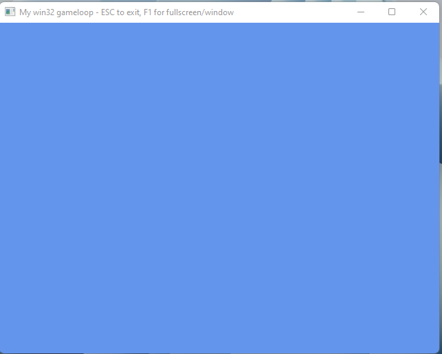

# Windows Game Loop

This is my (multiple) versions of putting together a Windows loop for game programming
using C and the win32 API.

There are multiple branches depending on the feature; I thought it'd be a lot easier
to keep updated vs. tags which get annoying to manage with updates (IMHO).

Note that the project files were built with VS2019, but the `./src` folder should be
capable of just being dropped into your own favorite IDE

## requirements

- Visual Studio, CLion, or any compiler really
- Some coffee
- Willing to have fun

## branch listing

| branch name | description |
| --- | --- |
| **main** | the basic game loop with a 640x480 client area |
| **center-window** | the basic game loop with code to center the game window |
| **window-fullscreen-toggle** | add support for a windowed / fullscreen toggle (w/ F1) |
| --- | --- |
| **main-loop-with-SDL2** | the basic game loop using SDL2 |
| **window-fullscreen-toggle-with-SDL2** | add support to the SDL2 game loop with windowed / fullscreen toggle |
| --- | --- |
| **main-loop-with-SFML** | the basic game loop using SFML |
| **window-fullscreen-toggle-with-SFML** | add support to the SFML game loop with windowed / fullscreen toggle |

# LICENSE

MIT License

Copyright (c) 2021 erikyuzwa

Permission is hereby granted, free of charge, to any person obtaining a copy
of this software and associated documentation files (the "Software"), to deal
in the Software without restriction, including without limitation the rights
to use, copy, modify, merge, publish, distribute, sublicense, and/or sell
copies of the Software, and to permit persons to whom the Software is
furnished to do so, subject to the following conditions:

The above copyright notice and this permission notice shall be included in all
copies or substantial portions of the Software.

THE SOFTWARE IS PROVIDED "AS IS", WITHOUT WARRANTY OF ANY KIND, EXPRESS OR
IMPLIED, INCLUDING BUT NOT LIMITED TO THE WARRANTIES OF MERCHANTABILITY,
FITNESS FOR A PARTICULAR PURPOSE AND NONINFRINGEMENT. IN NO EVENT SHALL THE
AUTHORS OR COPYRIGHT HOLDERS BE LIABLE FOR ANY CLAIM, DAMAGES OR OTHER
LIABILITY, WHETHER IN AN ACTION OF CONTRACT, TORT OR OTHERWISE, ARISING FROM,
OUT OF OR IN CONNECTION WITH THE SOFTWARE OR THE USE OR OTHER DEALINGS IN THE
SOFTWARE.